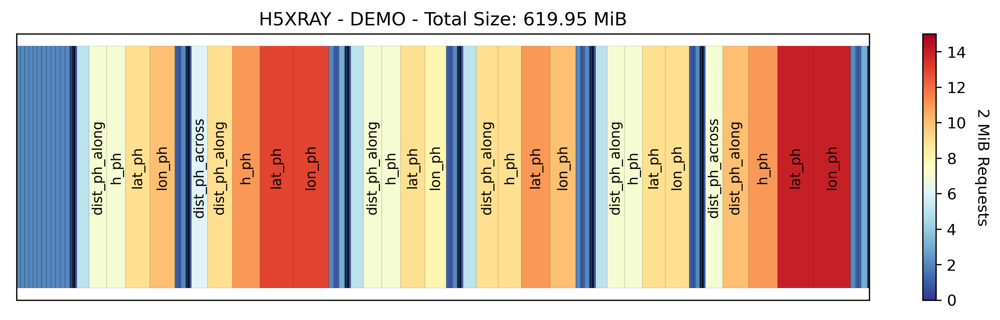
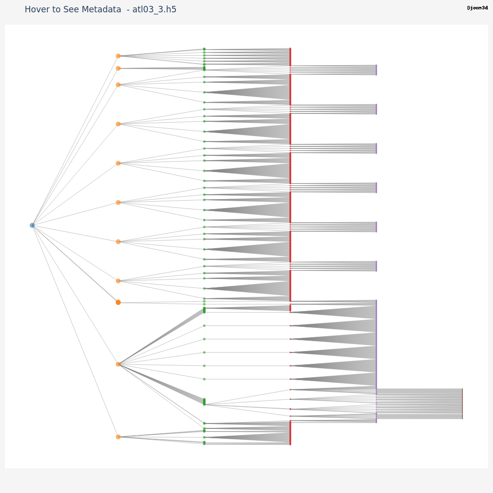

# H5XRay
Helping Python developers understand the structure and 'cloud-friendliness' of an HDF5 file. To best keep on top of updates, star/watch this repository.

Inspired by the h5cloud project at the 2023 ICESat-2 Hackweek.

## Installation
To get started with H5XRay, you can easily install it using pip. 

### Installation

```bash
pip install git+https://github.com/jonm3d/h5xray.git
```

### Updating to the Latest Version
```bash
pip install --upgrade git+https://github.com/jonm3d/h5xray.git
```

## Usage

```bash
h5xray /path/to/your/inputfile.h5
```

Example output. See demo.ipynb for usage examples.




## Interactive Tree Plot (In Progress)
Currently only in the test notebook.



Made with ❤️ and ☕️ by:

__Jonathan Markel__<br />
PhD Student<br /> 
3D Geospatial Laboratory<br />
The University of Texas at Austin<br />
jonathanmarkel@gmail.com<br />

[Twitter](https://twitter.com/jonm3d) | [GitHub](https://github.com/jonm3d) | [Website](http://j3d.space) | [GoogleScholar](https://scholar.google.com/citations?user=KwxwFgYAAAAJ&hl=en) | [LinkedIn](https://www.linkedin.com/in/j-markel/) 

This work was supported by NASA FINESST Award 80NSSC23K0272.

