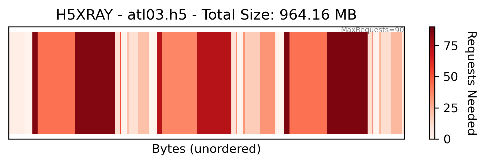

# H5XRay
Helping Python developers understand the structure and 'cloud-friendliness' of an HDF5 file.

## Installation
Download the h5xray package. It is highly recommended to install the package within a development environment.

```bash
pip install git+https://github.com/jonm3d/h5xray.git
```

### Update Package With Recent Changes
```bash
pip install --upgrade git+https://github.com/jonm3d/h5xray.git
```

## Usage

```bash
h5xray /path/to/your/inputfile.h5
```

:warning: This will generate __and save__ a plot for the specified HDF5 file. The output image file will be named `inputfile_xray.png`.


### Annotations 
Annotate each dataset larger than byte_threshold (default=0.5 MB) with the dataset name.

```bash
h5xray /path/to/your/inputfile.h5 --annotate
```


### Debug/Plot Boundary
Include plot axes, legend, colormap, etc. Otherwise, plots a simple barcode-style figure.

```bash
h5xray /path/to/your/inputfile.h5 --debug
```


### Adjust Figure Size
The output plot size can be configured from the command line in inches.

```bash
h5xray /path/to/your/inputfile.h5 --fisize 6,2
```


## Interactive Tree Plot (In Progress)
Currently only in the test notebook.


Made with ❤️ and ☕️ by:

__Jonathan Markel__<br />
PhD Student<br /> 
3D Geospatial Laboratory<br />
The University of Texas at Austin<br />
jonathanmarkel@gmail.com<br />

[Twitter](https://twitter.com/jonm3d) | [GitHub](https://github.com/jonm3d) | [Website](http://j3d.space) | [GoogleScholar](https://scholar.google.com/citations?user=KwxwFgYAAAAJ&hl=en) | [LinkedIn](https://www.linkedin.com/in/j-markel/) 

This work was supported by NASA FINESST Award 80NSSC23K0272.

