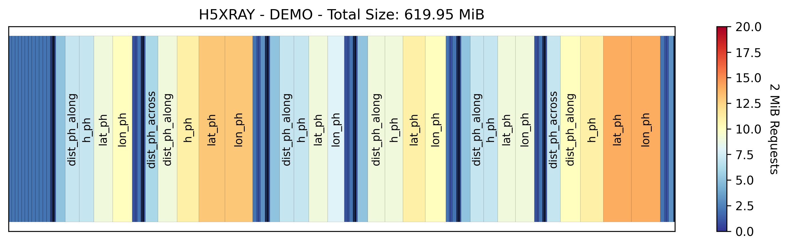

# H5XRay
Helping Python developers understand the structure and 'cloud-friendliness' of an HDF5 file. To best keep on top of updates, star/watch this repository.

A weekend project inspired by the h5cloud project at the 2023 ICESat-2 Hackweek.

Don't want to fuss with code? Try the [web app version (via Huggingface Spaces)](https://huggingface.co/spaces/jonm3d/h5xray-app).
## Installation
To get started with H5XRay, you can easily install it using pip. 

### Installation

```bash
pip install git+https://github.com/jonm3d/h5xray.git
```

### Updating to the Latest Version
```bash
pip install --upgrade git+https://github.com/jonm3d/h5xray.git
```

## Usage

```bash
h5xray /path/to/your/inputfile.h5
```

H5xray provides visualization and reports of an HDF5 file structure/readability. See the examples directory for more detailed usage, inluding reading local files or from S3.

### Example Visualizations




### Example Report Contents

Report for data/atl03_4.h5:

- Elapsed time (s): 1.373
- Total datasets: 1020
- Total requests: 1276.0
- Request byte size: 2097152 bytes
- Assumed cost per 1000 GET requests: $0.0004
- Total cost for file: $0.0005104

Top 5 datasets with most requests:
1. /gt3r/heights/lat_ph - 14.0 requests | Chunking: (10000,) | Number of Chunks: [616.0]
2. /gt3r/heights/lon_ph - 14.0 requests | Chunking: (10000,) | Number of Chunks: [616.0]
3. /gt1r/heights/lat_ph - 13.0 requests | Chunking: (10000,) | Number of Chunks: [583.0]
4. /gt1r/heights/lon_ph - 13.0 requests | Chunking: (10000,) | Number of Chunks: [583.0]
5. /gt1r/heights/h_ph - 11.0 requests | Chunking: (10000,) | Number of Chunks: [583.0]

System Info:
- OS: posix
- Platform: Linux
- Platform Version: #1 SMP Tue Feb 14 21:50:23 UTC 2023
- Python Version: 3.10.12
- Machine: x86_64
- Processor: x86_64
- Current Working Directory: /home/jovyan/h5xray
- Host Name: jupyter-jonm3d
- Number of CPUs: 4

## Interactive Tree Plot
The package also includes an interactive plot for inspecting HDF5 files in a jupyter notebook.


Made with ❤️ and ☕️ by:

__Jonathan Markel__<br />
PhD Student<br /> 
3D Geospatial Laboratory<br />
The University of Texas at Austin<br />
jonathanmarkel@gmail.com<br />

[Twitter](https://twitter.com/jonm3d) | [GitHub](https://github.com/jonm3d) | [Website](http://j3d.space) | [GoogleScholar](https://scholar.google.com/citations?user=KwxwFgYAAAAJ&hl=en) | [LinkedIn](https://www.linkedin.com/in/j-markel/) 

This work was supported by NASA FINESST Award 80NSSC23K0272.

