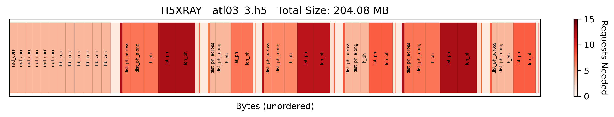
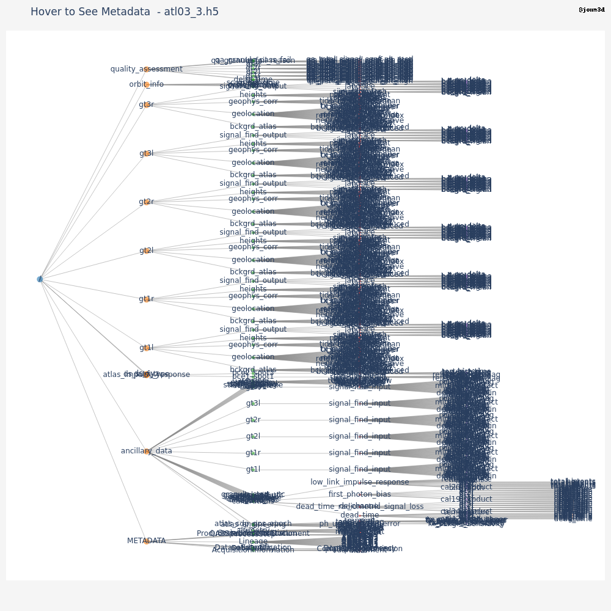

# H5XRay
Helping Python developers understand the structure and 'cloud-friendliness' of an HDF5 file.

**Basic Usage:**

```bash
python -m h5xray /path/to/your/inputfile.h5
```

This will generate a plot for the specified HDF5 file. The output image will be named `inputfile_xray.png`.

**Relevant Options:**

- **Annotations:** Annotate each dataset larger than byte_threshold with the dataset name.

```bash
python -m h5xray /path/to/your/inputfile.h5 --annotate
```

- **Debug/Plot Boundary:** Include plot axes, legend, colormap, etc. Otherwise, plots a simple barcode-style figure.

```bash
python -m h5xray /path/to/your/inputfile.h5 --debug
```




(Tree plot in progress)




Made with ❤️ and ☕️ by:

__Jonathan Markel__<br />
PhD Student<br /> 
3D Geospatial Laboratory<br />
The University of Texas at Austin<br />
jonathanmarkel@gmail.com<br />

[Twitter](https://twitter.com/jonm3d) | [GitHub](https://github.com/jonm3d) | [Website](http://j3d.space) | [GoogleScholar](https://scholar.google.com/citations?user=KwxwFgYAAAAJ&hl=en) | [LinkedIn](https://www.linkedin.com/in/j-markel/) 

This work was supported by NASA FINESST Award 80NSSC23K0272.

